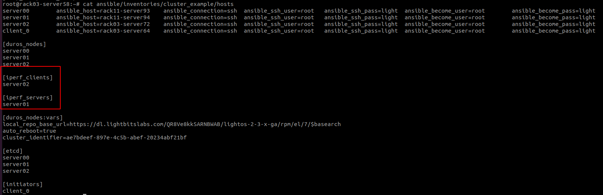

# This ansible playbook will do the next tasks: 

- Check **connectivity** between all duros_nodes in the cluster.
- Check for **DCPMM** in all targets and print output.  
- Check for active available **RAM** memory in cluster nodes.
- Sum and print the **NVME** devices in each node.
- Check **NTP** is enabled and synced on all targets.
- Check connectivity to outside world from each node. 
- Perform **iperf** Network Test between 2 (only 2!) target nodes on the **Data IP**, generate a report and print average bandwidth performance.
  - for this test > targets data_ip should be configured in host_vars.

 
#### *For running this playbook, please do the following:*

- Add 2 additional groups to inventory iperf_servers & iperf_clients

- Put this preinstall_validation.yml under /playbooks in your ansible installer machine

- Run the ansible: 

`ansible-playbook -i ansible/inventories/cluster_example/hosts playbooks/preinstall_validation.yml`
